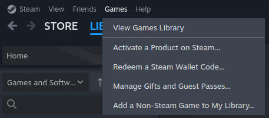
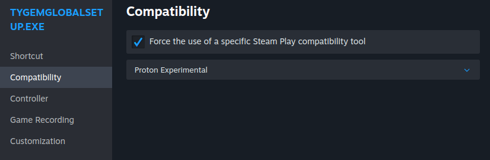
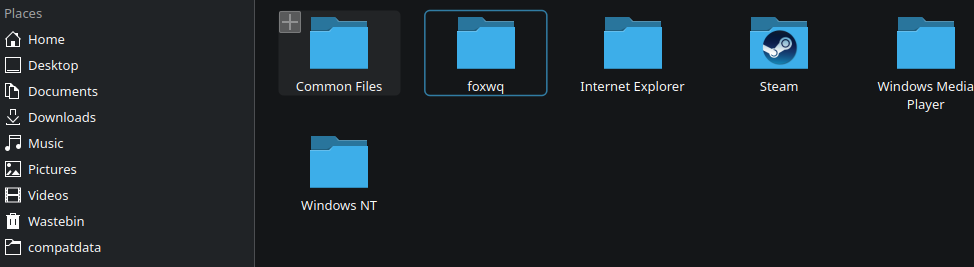
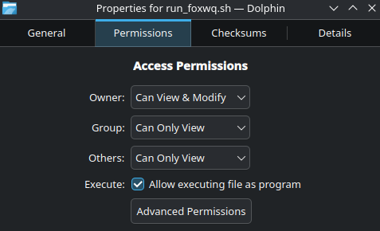
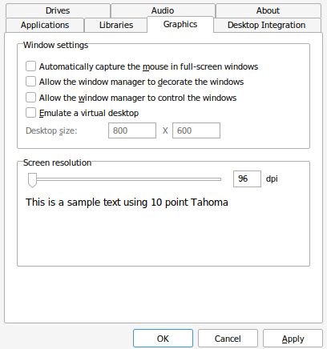
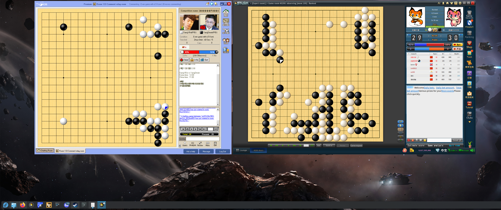

# How to Install and Run Tygem and Fox on Linux Fedora

Hello!

These instructions are for Linux Fedora KDE Plasma Desktop but should work for other distributions using their package managers. We are running the applications through Steam's Proton compatibility layer.

These instructions are provided with absolutely no warranty nor guarantee of usefulness. If you accidentally wipe or brick your system or if your PC explodes, that's on you.

## Prerequisites

Please install Steam through whichever method is recommended for your distribution. In Fedora, this is done through `dnf` like this.

```
sudo dnf install steam -y
```

To retrieve a nice-looking application icon for Fox and Tygem, we will use the `icoutils` package. In Fedora, you can install it like this.

```
sudo dnf install icoutils
```

We will also need `winetricks` to install a missing Windows dll for Tygem to work. I have had issues using the alternative `protontricks` library, so I have used `winetricks` here instead.

```
sudo dnf install winetricks
```

You will also need to create a few folders if they don't already exist. The first folder will contain the `.desktop` files (so that the applications automatically appear in the Applications menu, can be added to the taskbar, can be added to the Desktop, etc). The second folder will contain our shell scripts. The third contains our icon.

```
mkdir ~/.local/share/applications
mkdir ~/bin
mkdir ~/.local/share/icons
```

## Instructions for Fox 

Download whichever installer is appropriate for your region from [here](https://www.foxwq.com/soft.html). The instructions are based on the "download foreign" application but may work for others.

In Steam, click on Games on the menu bar, then click Add a Non-Steam Game to My Library. Like this:



Find the game in your library, right-click, and click "Properties". Then click "Compatibility". Click "Force the use of a specific Steam Play compatibility tool", then choose "Proton Experimental". Currently, the drop-down menu seems to choose a different option at first, so just make sure you do it a few times until the drop-down menu shows "Proton Experimental". Like this:



Exit out of the menu, and click Play. If you don't run any games via Proton, Steam will download it, alongside its Linux runtime. Then, the installer should start. Install the game using the default options just as you would on a Windows system. 

### Creating the Shell Script and running the Application

Neither Fox nor Tygem will work from Steam if you run them from Steam directly. Normally, what you would do is go back into the "Properties" menu, amend the Target to the launcher `.exe`, change the "Start In" field to the Steam folder containing the Game ID, and click "Play". But, it doesn't launch the application in any case. 

Therefore, we are going to write a small shell script to set a few variables. These variables are self-contained in the script - after the script exits, the variables disappear, so there is no danger of affecting other games ran via Proton in this way.

You need to replace the APPID in the below shell script with the APPID Steam has chosen for your game. To find this, first `cd` to the `compatdata` directory, like this: `cd ~/.steam/steam/steamapps/compatdata/` and then order the folders by date last modified, like this: `ls -t`. In general, it will be the name of the first directory in this list. 

But, to make sure, use your file browser to check the contents of the Program Files (x86) folder to see if you can find the foxwq folder. You need to enable hidden files in your file browser. In general, it will be on a path like this: `/home/user/.steam/steam/steamapps/compatdata/123456789/pfx/drive_c/Program Files (x86)/foxwq/`, like this:



Once you are sure that you are in the right place, you can traverse back up a few directory levels to check your APPID or click in the address bar of your file browser. Once you know it, paste this into a text editor, replacing the APPID:

```
#!/bin/bash
APPID=123456789
PROTON="$HOME/.steam/steam/steamapps/common/Proton - Experimental/proton"
STEAM_COMPAT_DATA_PATH="$HOME/.steam/steam/steamapps/compatdata/$APPID"
STEAM_COMPAT_CLIENT_INSTALL_PATH="$HOME/.steam/steam"
EXE_PATH="$STEAM_COMPAT_DATA_PATH/pfx/drive_c/Program Files (x86)/foxwq/foxwq/foxwq.exe"

# --- Launch ---
export STEAM_COMPAT_DATA_PATH
export STEAM_COMPAT_CLIENT_INSTALL_PATH
export PROTON_LOG=1

echo "Launching FoxWQ..."
"$PROTON" run "$EXE_PATH"
```

Put this in the `~/bin` folder and name it `run_foxwq.sh` and right-click the file, then click Properties. Click Permissions, then tick the box saying "Allow executing file as program". Click OK. Like this:



Now, double-click the file, and Fox should load.

### Making it a bit nicer

Now we are able to launch the program, let's make an icon for it, and a desktop file to run it. Paste this into a text editor and save it as `foxwq.desktop` in the directory we created earlier, `~/.local/share/applications` - but remember to replace each mention of `user` to the name of your own home folder.

```
[Desktop Entry]
Name=FoxWQ
Comment=Launch FoxWQ with Proton
Exec=/home/user/bin/run_foxwq.sh
Icon=/home/user/.local/share/icons/foxwq.png
Terminal=false
Type=Application
Categories=Game;
StartupNotify=true
```

Next is the icon. The icon for Fox seems to be embedded in the `.exe` file, at least, I could not find a good `.png` to use in any of its folders. So, we are going to extract the icon from the `.exe` and convert it. 

To do that, first `cd` into the folder containing the `foxwq.exe` launcher. Alternatively, you can (in most file browsers) browse to the `foxwq` folder, right-click in empty space, and run a Terminal from this folder. Here is the command, from the folder containing `foxwq.exe`:

```
wrestool -x -t14 "foxwq.exe" > foxwq_icons.ico
```

Move this `foxwq_icons.ico` to a convenient location. The next bit will create a bunch of `.png` files, so maybe create a `~/Desktop/tmp` folder or something like that (the command below will just shove them in your home folder, you can just delete them afterwards). Here is the command:

```
convert foxwq_icons.ico -resize 128x128 ~/foxwq.png
```

Pick whichever icon looks the best, rename it to `foxwq.png`, and move it to `~/.local/share/icons` (you might need to create this folder if it isn't already there). Fox should now appear in your Applications menu.

## Instructions for Tygem

These instructions rely on having gone through the equivalent instructions for Fox. So, even if you haven't installed Fox, I suggest you read the previous sections, then come back here.

Tygem, being a bit of an older application, is unfortunately not quite as straightforward as Fox, but it isn't hard. 

Follow the instructions as above for Fox - namely, add the .exe to Steam from [here](http://www.tygemgo.com/) (it's the Direct File Download link which looks like a Go stone). Choose the same Proton Experimental, click Play, and install the program. Don't try to run it from Steam, just like Fox, it won't work.

Tygem needs a dll that we have to add manually. Here is the command to do it, but you need to find the APPID for Tygem, use the instructions for Fox to find it either via your command line or from your file browser. Here is the command, replace 123456789 with your APPID:

```
WINEPREFIX=~/.steam/steam/steamapps/compatdata/123456789/pfx winetricks dlls --force -q mfc42
```

If it's your first time, Wine will prompt you to install mono, please do this. It will just automatically download and install this.

Next, we need to tell Wine, when running this application, to let it manage its own window. This is because, at least on Wayland / KDE, an endless battle ensues between the Windows application maximising itself, and the KDE window manager trying to resize the window if you click and drag it. Here is the command, again change the APPID please:

```
PROTON="$HOME/.steam/steam/steamapps/common/Proton - Experimental/proton"
PREFIX="$HOME/.steam/steam/steamapps/compatdata/123456789"
export STEAM_COMPAT_DATA_PATH="$PREFIX"
export STEAM_COMPAT_CLIENT_INSTALL_PATH="$HOME/.steam/steam"
"$PROTON" run winecfg
```

It launches a window. Click Graphics, and uncheck the options “allow the window manager to decorate the windows” and “allow the window manager to control the windows”, like this:



The last thing is the shell script. This is a bit different from the Fox script, because we need to start Tygem from its home directory. This is because, somewhere in the program, it's relying on the current working directory to find assets for its embedded web browser (the so-called CEF and associated libraries). This will result in an error message if we don't start the program from the right place. Here's the script, please replace the APPID:

```
#!/bin/bash
APPID=123456789
PROTON="$HOME/.steam/steam/steamapps/common/Proton - Experimental/proton"
PREFIX="$HOME/.steam/steam/steamapps/compatdata/$APPID"
APPDIR="$PREFIX/pfx/drive_c/Program Files (x86)/TygemGlobal2.0"
EXE="$APPDIR/TygemGlobal.exe"

export STEAM_COMPAT_DATA_PATH="$PREFIX"
export STEAM_COMPAT_CLIENT_INSTALL_PATH="$HOME/.steam/steam"
export PROTON_LOG=1

echo "Launching TygemGlobal..."
cd "$APPDIR" || exit 1
"$PROTON" run "./TygemGlobal.exe"

```

Tygem's installation directory actually has a perfectly fine `.ico` file to use, but it needs converting to `.png` first. Copy-paste the icon to somewhere convenient and then run the equivalent command just as we used for Fox:

```
convert TygemGlobal.ico -resize 128x128 ~/tygem.png
```

Rename the best icon to `tygem.png` and put it in the `~/.local/share/icons` folder.

Here is the .desktop file for Tygem, remember to replace the `user` mentions with the name of your home directory:

```
[Desktop Entry]
Name=Tygem
Comment=Launch Tygem with Proton
Exec=/home/user/bin/run_tygem.sh
Icon=/home/user/.local/share/icons/tygem.png
Terminal=false
Type=Application
Categories=Game;
StartupNotify=true
```

And that's it. Here is a screenshot of my system running the applications. Enjoy!


